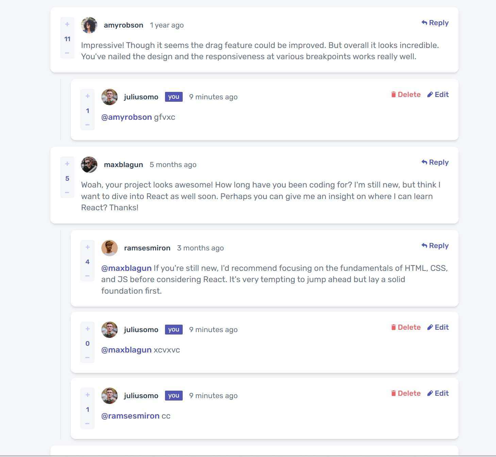

# Frontend Mentor - Interactive comments section solution

This is a solution to the [Interactive comments section challenge on Frontend Mentor](https://www.frontendmentor.io/challenges/interactive-comments-section-iG1RugEG9). Frontend Mentor challenges help you improve your coding skills by building realistic projects.

## Table of contents

- [Overview](#overview)
  - [The challenge](#the-challenge)
  - [Screenshot](#screenshot)
  - [Links](#links)
- [My process](#my-process)
  - [Built with](#built-with)
  - [What I learned](#what-i-learned)
  - [Continued development](#continued-development)
  - [Useful resources](#useful-resources)
- [Author](#author)
- [Acknowledgments](#acknowledgments)

## Overview

### The challenge

Users should be able to:

- View the optimal layout for the app depending on their device's screen size
- See hover states for all interactive elements on the page
- Create, Read, Update, and Delete comments and replies
- Upvote and downvote comments
- **Bonus**: If you're building a purely front-end project, use `localStorage` to save the current state in the browser that persists when the browser is refreshed.
- **Bonus**: Instead of using the `createdAt` strings from the `data.json` file, try using timestamps and dynamically track the time since the comment or reply was posted.

### Screenshot

### Links

- Solution URL: [Add solution URL here](https://github.com/KonieK981/interactive-comments-section)
- Live Site URL: [Add live site URL here](https://interactive-comments-section-two-nu.vercel.app/)

## My process

-My process
Planning and Analysis

Reviewed the provided Frontend Mentor design and defined the core features to implement.

Identified the need for global state management and data persistence to enhance the user experience.

-Environment Setup

Initialized the project with [Vite/Create React App] and structured the folders for components, contexts, hooks, and utilities.

-Global State Management with React Context

Implemented a Context Provider to manage the application's global state (e.g., items list, filters, search).

Used a reducer and defined clear action types to keep the state updates predictable and scalable.

-Data Persistence with LocalStorage

Integrated LocalStorage to save and restore the application state on page reload.

Used useEffect to synchronize state changes with LocalStorage in real time.

-Searching in Nested Objects and Arrays

Developed a utility function to traverse and filter nested data structures.

Optimized the search to be case-insensitive and efficient for larger datasets.

-UI Development

Built modular and reusable components (e.g., cards, buttons) to keep the code maintainable.

Styled the application according to the Frontend Mentor design, ensuring full responsiveness

### Built with

- Semantic HTML5 markup
- CSS custom properties
- Flexbox
- Mobile-first workflow
- [React](https://reactjs.org/) - JS library
- React Context
- LocalStorage

### Continued development

- Improve the architecture and optimize the use of states and functions that should be in global or context-separated scopes
- Create a backend for those data using NodeJS

### Useful resources

- [Reat](https://react.dev/)
- [AI](https://chatgpt.com/) Important to utilize it as support to learn and become more productive.

## Author

- Frontend Mentor - [@yourusername](https://www.frontendmentor.io/profile/KonieK981)
